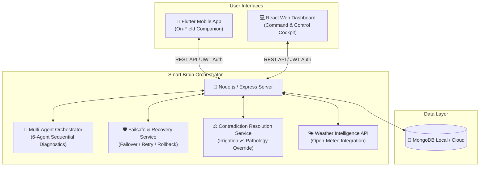
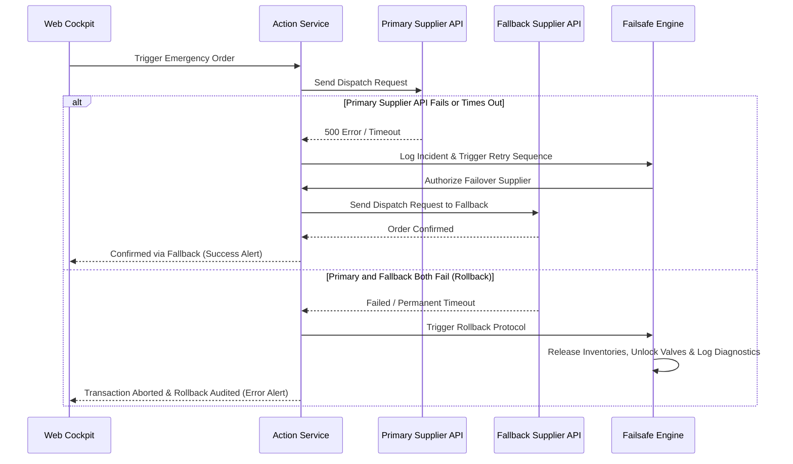

# 🌾 ArgoGuard AI: Intelligent Agricultural Co-Pilot & Resiliency Cockpit

[](https://opensource.org/licenses/MIT)
[](https://nodejs.org/)
[](https://flutter.dev/)
[](https://react.dev/)
[](https://tailwindcss.com/)

**ArgoGuard AI** is a state-of-the-art, dual-frontend smart farming ecosystem. Powered by a collaborative team of intelligent multi-agent systems and real-time localized weather intelligence, it enables farmers to proactively monitor crop health, orchestrate complex field diagnostics, and automate resilient recovery protocols to prevent agricultural loss.

---

## 🏗️ System Architecture

ArgoGuard AI is built upon a modular, highly resilient three-tier architecture:



---

## ⚡ Core Components

### 1. 💻 Web Dashboard Cockpit (Located inside the `frontend` directory)
The **Web Dashboard** is located in the `[frontend](file:///Users/muhamadzohaib/Downloads/ArgoGuardAi/frontend)` folder of this repository. Built with React (v19), Vite, and Tailwind CSS v4, it serves as the central **Command & Control Cockpit** for farm managers. Designed with a gorgeous, high-fidelity dark glassmorphic UI, it provides extensive security and observation capabilities:
*   **Proper Secure Authentication & OTP Verification:** 
    *   **Secure Email/Password Auth:** Full support for standard user registration (Name, Email, Password, operational Role selection) and logins.
    *   **Multi-Factor OTP (One-Time Password) Verification:** A built-in security check. Users must verify their accounts using a 6-digit OTP verification code sent to their email (or simulated locally if the backend is offline).
    *   **Social OAuth Sign-In:** Beautiful, styled buttons for "Continue with Google" and "Continue with Facebook" for instant third-party authentication.
    *   **Session Persistence:** Checks for stored JWT tokens in `localStorage` on startup. If the backend is connected, it verifies credentials via the `/auth/me` endpoint; if offline, it restores simulated session details seamlessly.
*   **6-Agent Diagnostic Runner:** Manually or automatically trigger the sequential agent pipeline (Input Aggregation ➡️ Disease Analysis ➡️ Risk Assessment ➡️ Constraint Planning ➡️ Action Execution ➡️ Recovery). View precise observation, reasoning, action, outcome, and recovery telemetry logs in real time.
*   **Treatment Simulation Slider:** An interactive, side-by-side comparison slider showing before vs after states of diseased foliage (e.g. Tomato Late Blight) to visualize recovery progress.
*   **Hardware/Action Simulation Engine:** Run failure scenarios (such as API timeouts, internal 500 errors, invalid supplier responses, and missing geographical coordinate exceptions) to test backend resiliency. Displays live financial cost calculations, latency, retry attempts, state rollback audits, and before-and-after state snapshots.
*   **Historic Crop Health Analytics:** Gorgeous Recharts-powered graphs monitoring weekly crop health indexes and zonal soil moisture vs spread risks.
*   **Live Safety Alerts Grid:** Immediate visual highlights on ongoing failsafe overrides and spore-multiplication warnings.

### 2. 📱 Mobile App (Flutter)
The **Mobile App** is the on-field companion for agricultural workers:
*   **Crop Disease Camera Scanner:** Capture or upload images of crop anomalies for immediate, high-confidence computer vision disease detection.
*   **Location-Aware Meteorological Insights:** Fetches real-time weather metrics (wind speed, humidity, precipitation probability) and maps them to agricultural recommendations (e.g., advising against pesticide spraying during excessive winds).
*   **Offline Mode Support:** Graceful offline fallbacks with persistent local caching.

### 3. 🧠 Smart Brain Backend (Node.js + Express + MongoDB)
The central intelligence repository managing coordination, safety overrides, and APIs:
*   **Multi-Agent Orchestrator:** Seamlessly coordinates the specialized agent network to make comprehensive decisions.
*   **Contradiction Resolution Service:** Resolves conflicting operational procedures (e.g. blocking daily overhead watering recommendations if the active disease scanner identifies a spore-based pathogen like *Late Blight* that thrives on wet foliage).
*   **Failsafe Recovery Engine:** Handles unstable hardware interfaces, tracking transient supplier timeouts, retrying actions, engaging fallback suppliers on complete failure, and executing rollback transactions (like venting pressure locks or restoring standard irrigation) in case of permanent failure.

---

## 🛠️ Technology Stack

| Component | Technologies Used |
| :--- | :--- |
| **Mobile Frontend** | Flutter, Dart, Provider Pattern, Geolocator, HTTP Client |
| **Web Frontend** | React, Vite, Tailwind CSS v4, Lucide React, Axios, Recharts |
| **Backend API** | Node.js, Express.js, JWT Authentication, Multer |
| **Orchestration** | Gemini Generative AI Multimodal APIs (Vision + Diagnostics) |
| **Database** | MongoDB (Mongoose Object Modeling) |

---

## 🚀 How to Run the Project

### Prerequisites
*   **Node.js** (v18 or higher)
*   **Flutter** (v3.0.0 or higher)
*   **npm** or **yarn**
*   **Gemini API Key**

---

### Step 1: Start the Backend (The Brain)

1. Navigate to the backend directory:
    ```bash
    cd backend
    ```
2. Install dependencies:
    ```bash
    npm install
    ```
3. Configure Environment Variables: Create a `.env` file in the `backend` folder and add:
    ```text
    PORT=5000
    GEMINI_API_KEY=your_gemini_api_key_here
    JWT_SECRET=your_jwt_secret_key_here
    MONGODB_URI=mongodb://localhost:27017/argoguard
    ```
4. Start the server in development mode:
    ```bash
    npm run dev
    ```

---

### Step 2: Start the Web Dashboard (The Cockpit)

1. Open a new terminal and navigate to the frontend directory:
    ```bash
    cd frontend
    ```
2. Install dependencies:
    ```bash
    npm install
    ```
3. Run the Vite development server:
    ```bash
    npm run dev
    ```
4. Access the dashboard in your web browser at `http://localhost:5173`.
*(Note: If the backend is offline, the dashboard automatically runs in a gorgeous, high-fidelity premium simulation mode so you can still fully interact with the 6-agent runner and the failover simulator).*

---

### Step 3: Start the Mobile App (The Phone Interface)

1. Open a new terminal and ensure you are in the root directory.
2. Ingest Flutter package dependencies:
    ```bash
    flutter pub get
    ```
3. Launch the app on a connected emulator or real device:
    ```bash
    flutter run
    ```

---

## 🛡️ Resiliency & Safety Architecture

ArgoGuard AI is engineered to survive hostile environments. It implements automatic failovers for critical workflows:



This ensures agricultural hardware actuators never remain stuck in unsafe configurations, providing total security peace of mind.
